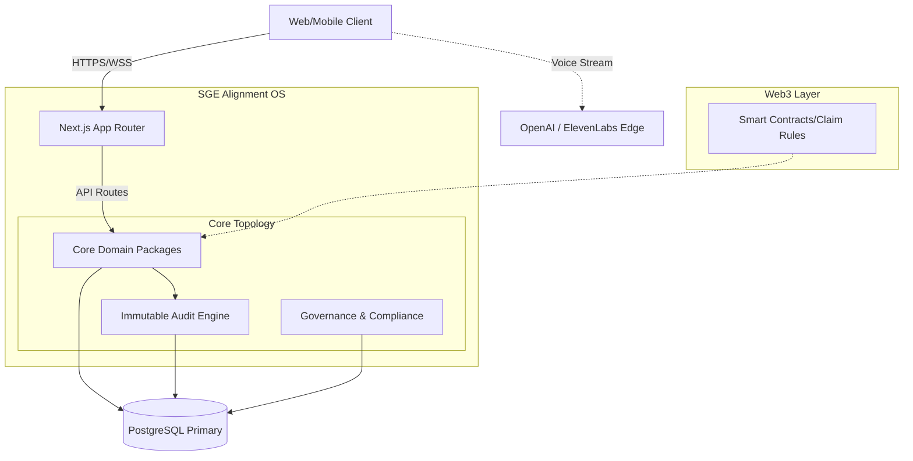

<div align="center">

# 🟢 SGE Alignment OS
**Scalable Green Energy Alignment Operating System**

[](https://nextjs.org/)
[](https://www.typescriptlang.org/)
[](https://www.prisma.io/)
[](https://pages.cloudflare.com/)
[](#license)

*A production-grade monorepo platform encompassing climate infrastructure alignment, tiered partner management, verifiable standards governance, and cryptographic audit chains.*

</div>

<br />

> [!NOTE]
> **Executive Summary:** The SGE Alignment OS is the core backend and frontend operational layer bridging physical green energy infrastructure deployments with immutable audit logs, strict Role-Based Access Controls (RBAC), and interactive AI workflows.

---

## 📖 Table of Contents
- [Architecture & Topology](#-architecture--topology)
- [System Capabilities](#-system-capabilities)
- [Feature Matrix](#-feature-matrix)
- [Repository Structure](#-repository-structure)
- [Quick Start Pipeline](#-quick-start-pipeline)
- [API & Integration Surface](#-api--integration-surface)
- [Security & RBAC Controls](#-security--rbac-controls)

---

## 🏗 Architecture & Topology

SGE Alignment OS utilizes a modern, serverless-capable edge monorepo. The core logic handles high-throughput state transitions while strictly enforcing an append-only Audit Chain for verification.



---

## ⚡ System Capabilities

1. **Partner & Organization Ecosystem** 
   - Tiered scaling (Bronze → Platinum).
   - Lifecycle tracking, organization linkage, and aggregate capacity reporting.
2. **Project Deployment Tracking** 
   - State-machine lifecycle (Planning → Construction → Commissioning → Operational).
3. **Immutable Audit Engine** 
   - SHA-256 integrity-verified audit chains linking actors, resources, and payloads to every system mutation.
4. **Interactive AI Guidance (Voice)** 
   - Web Speech API combined with ElevenLabs & GPT-4o for realtime, verbal platform navigation.
5. **On-Chain Settlement Integration** 
   - Support for Web3 claim structures, allowance checks, and reconciliation loops.

---

## 📊 Feature Matrix

| Subsystem | Feature | Status | Owner |
|-----------|---------|:------:|-------|
| **Core** | Multi-tenant RBAC (8-Levels) | 🟢 Complete | `@SGE-Foundation` |
| **Data** | Prisma Schema & Generics | 🟢 Complete | `@SGE-Foundation` |
| **Audit** | Immutable Event Ledger | 🟢 Complete | `@SGE-Foundation` |
| **AI** | Voice-Assisted Interaction | 🟢 Complete | `@SGE-Foundation` |
| **Ops** | Auto-Deploy CI/CD Pipeline | 🟢 Complete | `DevOps` |
| **Web3** | Smart Contract Claim Sync | 🟡 In Progress | `@SGE-Foundation` |
| **Compliance** | Automated Standard Ratification | ⚪ Planned | `Governance` |

> *Legend: 🟢 Complete | 🟡 In Progress | ⚪ Planned | 🔴 Blocked*

---

## 📂 Repository Structure

Our monorepo utilizes **Turborepo** + **pnpm** workspaces for optimized, cached build layers.

```text
sge-alignment-os/
├── apps/
│   ├── web/          # Next.js 14 App Router (Primary OS Dashboard)
│   ├── docs/         # Documentation site (Next.js)
│   └── api/          # Standalone Express API Gateway
├── packages/
│   ├── audit/        # Trustless hash-linked audit engine
│   ├── config/       # Shared TypeScript & Tailwind configs
│   ├── core/         # Core business logic (Governance, Projects)
│   ├── db/           # Prisma client, schemas, and seeds
│   ├── sdk/          # Extensible SDK for 3rd party B2B integrators
│   ├── types/        # Global TypeScript interfaces
│   ├── ui/           # Custom dark-theme enterprise design system
│   └── utils/        # Cryptography, math, and string utilities
├── docs/             # High-level architecture and operations manual
└── .github/          # CI/CD Workflows (Cloudflare Edge deploy), Issue Templates
```

---

## 🚀 Quick Start Pipeline

**Prerequisites:** 
- `Node.js >= 20`
- `pnpm >= 9.x`
- `PostgreSQL >= 15`

```bash
# 1. Clone the repository
git clone https://github.com/FTHTRading/sge.git sge-alignment-os
cd sge-alignment-os

# 2. Install workspace dependencies
pnpm install

# 3. Configure local environment variables
cp apps/web/.env.example apps/web/.env.local
# Inject DATABASE_URL, NEXTAUTH_SECRET, OPENAI_API_KEY, ELEVENLABS_API_KEY

# 4. Bootstrap Prisma and the Database
pnpm db:generate
pnpm db:push
pnpm db:seed

# 5. Ignite the development cluster
pnpm dev
```

---

## 🔐 Security & RBAC Controls

Security is handled at the **edge routing** middleware layer and enforced synchronously at the database layer using NextAuth sessions coupled with robust Prisma extensions.

> [!IMPORTANT]
> The platform adheres to an **8-tier RBAC system**. Refer to [`docs/security/security-model.md`](docs/security/security-model.md) for full separation-of-duties guidelines.

| Role | Access Level | Description |
|------|-------------|-------------|
| `super_admin` | 100 | Absolute platform control. |
| `admin` | 90 | Environment & management functions. |
| `auditor` | 70 | Read-only compliance + certification action access. |
| `partner_admin` | 60 | Admin for specific sub-organizations. |

*For immediate vulnerability reports, email security@sge.foundation or consult `SECURITY.md`.*

---

## 📜 License & Telemetry

**Proprietary Software — SGE Foundation.** 
Modification, distribution, or external use without written consent is strictly prohibited.
