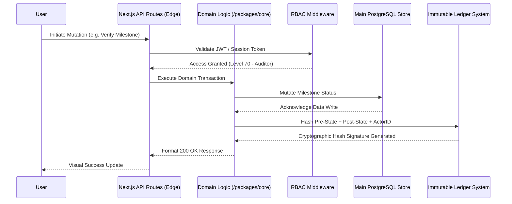

# System Architecture Overview

The SGE Alignment OS runs on a modern decoupled architecture consisting of an Edge-deployed Next.js application, an interconnected Turborepo workspace, and an Immutable Postgres-based audit ledger.

## Core Tenets
- **Serverless First:** All frontend routes and APIs are tailored for Vercel/Cloudflare edge networks to lower TTFB (Time to First Byte).
- **Separation of Concerns:** Business logic belongs in `packages/core/`, strictly isolated from the UI components (`packages/ui/`) and Database schema definitions (`packages/db/`).
- **Verifiability:** Changes requested by users hit a Middleware layer validating RBAC state. Successful changes are sent to the Postgres Primary database while simultaneously broadcasting a hash representation to the `packages/audit` ledger.

## High-Level Topology Walkthrough

